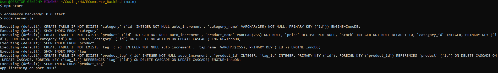
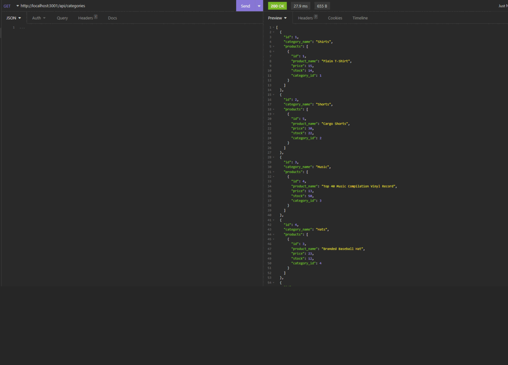
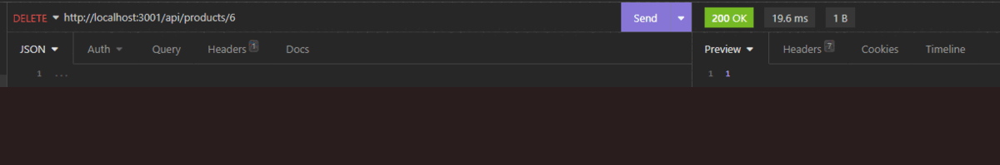

# E-commerce Back End

## Description: In this application, a user such as a manager has a back end access to view, update, or delete data from a database for an an E-commerce website. In order to access the application, the user would have to add their MySQL username and passowrd to an environment variable file. (See .env.EXAMPLE) 

## After starting the application in terminal, the user can access the data through routes in Insomnia. The user can either view all categories, all products, or all tags within the data, or locate a category, product, and tag by its unique id. In addition, the user can update or delete a product/category/tag by its id. 
---
### This application is initialized using command-line application, and access the employee database using mySQL. The resulting data are displayed using Insomnia Core.

### NOTE: This application utilizes the following node packages: dotenv version 8.2.0, express version 4.17.1, mySQL2 version 2.1.0, and sequelize version 5.21.7
---
---

## 
## 
## 

---

## Table of Contents
  - [Installation](#installation)
  - [Usage](#usage)
  - [License](#license)
  - [Contributing](#contributing)
  - [Tests](#tests)
  - [Questions](#questions)

---
## Installation

A user can clone the files found in this repo then install the required node packages by running `npm i` in the command-line application. Use the `schema.sql` file in the db folder to create the database using `MySQL` shell commands. Create and use a `.env` file to store the MySQL username and password. Refer to the file `.env.EXAMPLE` on how to store those sensitive data. Next, seed the database by running the command `node index.js` on the file located in the seeds folder, or by simplying running `npm run seed`. Finally, run the command `node server.js` in terminal and perform the requests (GET, PUT, POST, DELETE) on the appropriate route.

## Usage

In terminal and after installing the necessary node packages and creating/seeding the database (as outlined above), open Insomnia Core and perform the different possible requests on one of the three routes (api/categories, api/tags, api/products). For additional information, please reference the video linked below.

[Walkthrough Video](https://drive.google.com/file/d/1eO_pAhiyIFrfLsRmNwQ4j-1n-hsitpx2/view?usp=sharing)

## License

This application is unlicensed

## Contributing

Visit my GitHub or Send me an email

## Tests

There are no tests written at this time

---
## Questions

If you have any questions, please visit my GitHub or send me an email.

[GitHub Link](https://github.com/momaki9)

[Email Me!](mailto:mostafa_m9@yahoo.com)